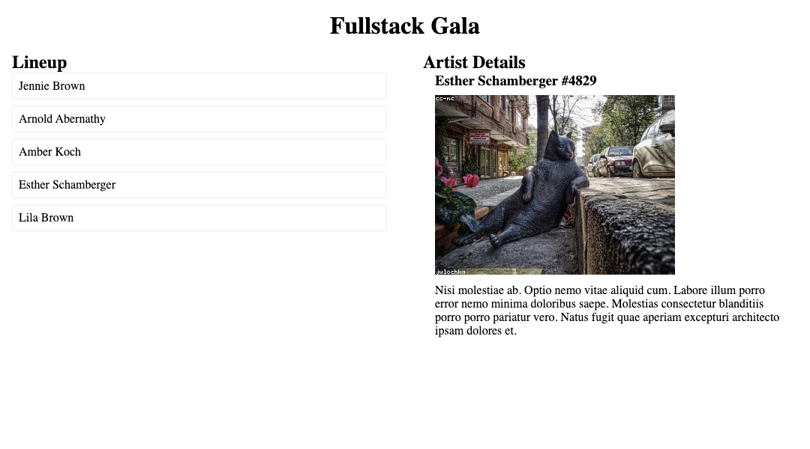

# Fullstack Gala



The [Fullstack Convention Center](https://fsa-crud-2aa9294fe819.herokuapp.com/api/) often invites a variety of artists to perform. The main gallery showcases a permanent collection, and several rotating exhibits can be found throughout the building. The Fullstack Gala is coming up, so you'll be building a web application that displays information about the associated artists.

## Instructions

1. Clone this repository down to your local machine and open it with VS Code. This will not be submitted.
2. Designate one person in your group to be the initial Driver. Everyone else will be a Navigator.
3. Read the existing code.

> [!WARNING]
>
> Make sure you've changed the `COHORT` code in `index.js` before doing the rest of the activity!
> See more details about API usage at the [Fullstack Convention Center API docs](https://fsa-crud-2aa9294fe819.herokuapp.com/api/).

## Render all the artists

1. Complete `getArtists` to fetch all the artists from the API. It should update `artists` in state, then rerender the page.
2. Complete the `ArtistListItem` component. It should return an element with this structure:
   ```html
   <li><a href="#selected">{artist name}</a></li>
   ```
3. Complete the `ArtistList` component. It should return a `<ul class="lineup">` with each artist in state as an `ArtistListItem`.

Once you see the names of all the artists from the API, designate a new person to be the Driver and continue to the next section.

## Select an artist to see more

4. Complete `getArtist` to fetch the requested artist from the API with the given ID. It should update `selectedArtist` in state, then rerender the page.
5. Add an event listener to `ArtistListItem` so that when it is clicked, it will call `getArtist` with the corresponding id.
6. Complete the `ArtistDetails` component so that when there is a selected artist in state, it will return an element with this structure:
   ```html
   <section class="artist">
     <h3>{artist name} #{artist id}</h3>
     <figure>
       
     </figure>
     <p>{artist description}</p>
   </section>
   ```

Congrats! You should now be able to click on the name of an artist in the line up to see more information about that artist.
